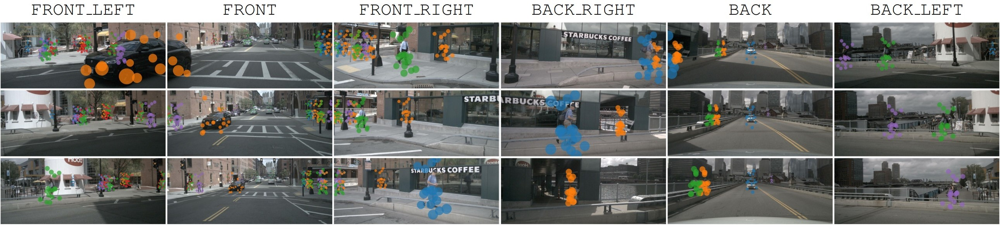

# SparseBEV

[](https://paperswithcode.com/sota/3d-object-detection-on-nuscenes-camera-only?p=sparsebev-high-performance-sparse-3d-object)

This is the official PyTorch implementation for our ICCV 2023 paper:

> [**SparseBEV: High-Performance Sparse 3D Object Detection from Multi-Camera Videos**](https://arxiv.org/abs/2308.09244)<br>
> [Haisong Liu](https://scholar.google.com/citations?user=Z9yWFA0AAAAJ&hl=en&oi=sra), [Yao Teng](https://scholar.google.com/citations?user=eLIsViIAAAAJ&hl=en&oi=sra), [Tao Lu](https://scholar.google.com/citations?user=Ch28NiIAAAAJ&hl=en&oi=sra), [Haiguang Wang](https://miraclesinwang.github.io/), [Limin Wang](https://scholar.google.com/citations?user=HEuN8PcAAAAJ&hl=en&oi=sra)<br>Nanjing University, Shanghai AI Lab

中文解读：[https://zhuanlan.zhihu.com/p/654821380](https://zhuanlan.zhihu.com/p/654821380)



## News

* 2024-03-31: The code of SparseOcc is released at [https://github.com/MCG-NJU/SparseOcc](https://github.com/MCG-NJU/SparseOcc).
* 2023-12-29: Check out our new paper ([https://arxiv.org/abs/2312.17118](https://arxiv.org/abs/2312.17118)) to learn about SparseOcc, a fully sparse architecture for panoptic occupancy!
* 2023-10-20: We provide code for visualizing the predictions and the sampling points, as requested in [#25](https://github.com/MCG-NJU/SparseBEV/issues/25).
* 2023-09-23: We release [the native PyTorch implementation of sparse sampling](https://github.com/MCG-NJU/SparseBEV/blob/97c8c798284555accedd0625395dd397fa4511d2/models/csrc/wrapper.py#L14). You can use this version if you encounter problems when compiling CUDA operators. It’s only about 15% slower.
* 2023-08-21: We release the paper, code and pretrained weights.
* 2023-07-14: SparseBEV is accepted to ICCV 2023.
* 2023-02-09: SparseBEV-Beta achieves 65.6 NDS on [the nuScenes leaderboard](https://eval.ai/web/challenges/challenge-page/356/leaderboard/1012).

## Model Zoo

| Setting  | Pretrain | Training Cost | NDS<sub>val</sub> | NDS<sub>test</sub> | FPS | Weights |
|----------|:--------:|:-------------:|:-----------------:|:------------------:|:---:|:-------:|
| [r50_nuimg_704x256](configs/r50_nuimg_704x256.py) | [nuImg](https://download.openmmlab.com/mmdetection3d/v0.1.0_models/nuimages_semseg/cascade_mask_rcnn_r50_fpn_coco-20e_20e_nuim/cascade_mask_rcnn_r50_fpn_coco-20e_20e_nuim_20201009_124951-40963960.pth) | 21h (8x2080Ti) | 55.6 | - | 15.8 | [gdrive](https://drive.google.com/file/d/1ft34-pxLpHGo2Aw-jowEtCxyXcqszHNn/view) |
| [r50_nuimg_704x256_400q_36ep](configs/r50_nuimg_704x256_400q_36ep.py) | [nuImg](https://download.openmmlab.com/mmdetection3d/v0.1.0_models/nuimages_semseg/cascade_mask_rcnn_r50_fpn_coco-20e_20e_nuim/cascade_mask_rcnn_r50_fpn_coco-20e_20e_nuim_20201009_124951-40963960.pth) | 28h (8x2080Ti) | 55.8 | - | 23.5 | [gdrive](https://drive.google.com/file/d/1C_Vn3iiSnSW1Dw1r0DkjJMwvHC5Y3zTN/view) |
| [r101_nuimg_1408x512](configs/r101_nuimg_1408x512.py) | [nuImg](https://download.openmmlab.com/mmdetection3d/v0.1.0_models/nuimages_semseg/cascade_mask_rcnn_r101_fpn_1x_nuim/cascade_mask_rcnn_r101_fpn_1x_nuim_20201024_134804-45215b1e.pth) | 2d8h (8xV100) | 59.2 | - | 6.5 | [gdrive](https://drive.google.com/file/d/1dKu5cR1fuo-O0ynyBh-RCPtHrgut29mN/view) |
| [vov99_dd3d_1600x640_trainval_future](configs/vov99_dd3d_1600x640_trainval_future.py) | [DD3D](https://drive.google.com/file/d/1gQkhWERCzAosBwG5bh2BKkt1k0TJZt-A/view) | 4d1h (8xA100) | 84.9 | 67.5 | - | [gdrive](https://drive.google.com/file/d/1TL0QoCiWD5uq8PCAWWE3A-g73ibK1R0S/view) |
| [vit_eva02_1600x640_trainval_future](configs/vit_eva02_1600x640_trainval_future.py) | [EVA02](https://huggingface.co/Yuxin-CV/EVA-02/blob/main/eva02/det/eva02_L_coco_seg_sys_o365.pth) | 11d (8xA100) | 85.3 | 70.2 | - | [gdrive](https://drive.google.com/file/d/1cx7h6PUqiaVWPixpcuB9AhsX3Sx4n0q_/view) |

* We use `r50_nuimg_704x256` for ablation studies and `r50_nuimg_704x256_400q_36ep` for comparison with others.
* We recommend using `r50_nuimg_704x256` to validate new ideas since it trains faster and the result is more stable.
* FPS is measured with AMD 5800X CPU and RTX 3090 GPU (without `fp16`).
* The noise is around 0.3 NDS.

## Environment

Install PyTorch 2.0 + CUDA 11.8:

```
conda create -n sparsebev python=3.8
conda activate sparsebev
conda install pytorch==2.0.0 torchvision==0.15.0 pytorch-cuda=11.8 -c pytorch -c nvidia
```

or PyTorch 1.10.2 + CUDA 10.2 for older GPUs:

```
conda create -n sparsebev python=3.8
conda activate sparsebev
conda install pytorch==1.10.2 torchvision==0.11.3 cudatoolkit=10.2 -c pytorch
```

Install other dependencies:

```
pip install openmim
mim install mmcv-full==1.6.0
mim install mmdet==2.28.2
mim install mmsegmentation==0.30.0
mim install mmdet3d==1.0.0rc6
pip install setuptools==59.5.0
pip install numpy==1.23.5
```

Install turbojpeg and pillow-simd to speed up data loading (optional but important):

```
sudo apt-get update
sudo apt-get install -y libturbojpeg
pip install pyturbojpeg
pip uninstall pillow
pip install pillow-simd==9.0.0.post1
```

Compile CUDA extensions:

```
cd models/csrc
python setup.py build_ext --inplace
```

## Prepare Dataset

1. Download nuScenes from [https://www.nuscenes.org/nuscenes](https://www.nuscenes.org/nuscenes) and put it in `data/nuscenes`.
2. Download the generated info file from [Google Drive](https://drive.google.com/file/d/1uyoUuSRIVScrm_CUpge6V_UzwDT61ODO/view?usp=sharing) and unzip it.
3. Folder structure:

```
data/nuscenes
├── maps
├── nuscenes_infos_test_sweep.pkl
├── nuscenes_infos_train_sweep.pkl
├── nuscenes_infos_train_mini_sweep.pkl
├── nuscenes_infos_val_sweep.pkl
├── nuscenes_infos_val_mini_sweep.pkl
├── samples
├── sweeps
├── v1.0-test
└── v1.0-trainval
```

These `*.pkl` files can also be generated with our script: `gen_sweep_info.py`.

## Training

Download pretrained weights and put it in directory `pretrain/`:

```
pretrain
├── cascade_mask_rcnn_r101_fpn_1x_nuim_20201024_134804-45215b1e.pth
├── cascade_mask_rcnn_r50_fpn_coco-20e_20e_nuim_20201009_124951-40963960.pth
```

Train SparseBEV with 8 GPUs:

```
torchrun --nproc_per_node 8 train.py --config configs/r50_nuimg_704x256.py
```

Train SparseBEV with 4 GPUs (i.e the last four GPUs):

```
export CUDA_VISIBLE_DEVICES=4,5,6,7
torchrun --nproc_per_node 4 train.py --config configs/r50_nuimg_704x256.py
```

The batch size for each GPU will be scaled automatically. So there is no need to modify the `batch_size` in config files.

## Evaluation

Single-GPU evaluation:

```
export CUDA_VISIBLE_DEVICES=0
python val.py --config configs/r50_nuimg_704x256.py --weights checkpoints/r50_nuimg_704x256.pth
```

Multi-GPU evaluation:

```
export CUDA_VISIBLE_DEVICES=0,1,2,3,4,5,6,7
torchrun --nproc_per_node 8 val.py --config configs/r50_nuimg_704x256.py --weights checkpoints/r50_nuimg_704x256.pth
```

## Timing

FPS is measured with a single GPU:

```
export CUDA_VISIBLE_DEVICES=0
python timing.py --config configs/r50_nuimg_704x256.py --weights checkpoints/r50_nuimg_704x256.pth
```

## Visualization

Visualize the predicted bbox:

```
python viz_bbox_predictions.py --config configs/r50_nuimg_704x256.py --weights checkpoints/r50_nuimg_704x256.pth
```

Visualize the sampling points (like Fig. 6 in the paper):

```
python viz_sample_points.py --config configs/r50_nuimg_704x256.py --weights checkpoints/r50_nuimg_704x256.pth
```

## Acknowledgements

Many thanks to these excellent open-source projects:

* 3D Detection: [DETR3D](https://github.com/WangYueFt/detr3d), [PETR](https://github.com/megvii-research/PETR), [BEVFormer](https://github.com/fundamentalvision/BEVFormer), [BEVDet](https://github.com/HuangJunJie2017/BEVDet), [StreamPETR](https://github.com/exiawsh/StreamPETR)
* 2D Detection: [AdaMixer](https://github.com/MCG-NJU/AdaMixer), [DN-DETR](https://github.com/IDEA-Research/DN-DETR)
* Codebase: [MMDetection3D](https://github.com/open-mmlab/mmdetection3d), [CamLiFlow](https://github.com/MCG-NJU/CamLiFlow)
